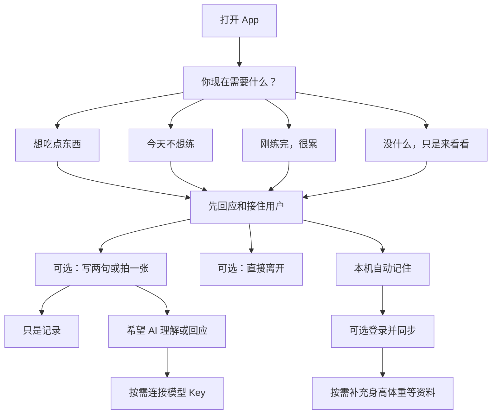

# 功能线路图

## 1. 产品定位

这是一个面向“同时上班、控制体重、偶尔健身”的普通人的非审判型陪伴工具。

它不负责提供专业运动课程、饮食处方或减肥社区。它负责在用户想吃、不想练、练完很累、吃多了或者只是想打开看一眼时，接住用户，并允许用户诚实记录。

一句话原则：

> 记住用户，但绝不拿记忆审判用户。

## 2. 产品边界

### 要做

- 不登录即可使用，本机记住用户与历史。
- 用户可以不填写身高、体重和目标。
- 用户可以不连接大模型，仍能获得完整的基础陪伴。
- 支持“想吃”“不想练”“练完很累”“只是来看看”四种核心状态。
- 支持文字、照片和极简选项记录。
- 拍照后先询问用户想获得什么，再决定是否识别食物或估算热量。
- 记录真实发生的事情，不评价成功或失败。
- 登录只用于备份、换机恢复和多设备同步。

### 明确不做

- 运动课程和动作教学。
- 专业训练计划。
- 减肥社区、关注关系和排行榜。
- 连续打卡、断签惩罚和“打败多少用户”。
- 强制热量预算和红色超标警告。
- 自动生成补偿运动或节食建议。
- 医疗诊断、饮食处方或替代专业治疗。

## 3. 核心体验链路

首次打开时，不出现登录墙、资料表或连接 Key 页面。用户必须先得到一次有价值的回应。

## 4. 首页结构

首页不是数据看板，而是当前状态入口。

主问题：

> 你现在需要什么？

四个主要入口：

1. 我想吃点东西
2. 我今天不想练
3. 我刚练完，感觉很累
4. 没什么，只是想来坐坐

辅助入口：

- 拍一张
- 写两句
- 看看最近发生了什么

“拍照打卡”和“记录打卡”是工具，不是首页的主角。

## 5. 四条核心分支

### 5.1 想吃点东西

先回应：

> 想吃就可以吃。你不需要先向我证明自己今天表现得很好。

再询问用户需要什么：

- 我只是想听你说吃也没关系
- 陪我想想我现在是真的饿，还是太累了
- 我想拍下来，但不要算热量
- 给我一个宽松的热量范围
- 什么也不用做，替我记住就好

即使选择热量估算，也只给区间和不确定性，不把数字变成判决。

### 5.2 今天不想练

先承认工作和生活已经造成消耗，不默认用户需要被重新激励。

可选去向：

- 就休息
- 玩游戏或看剧
- 出门走走
- 逛商场或买点东西
- 做五分钟轻松活动
- 不想选，陪我待一会儿

散步、逛街和做家务属于身体活动，但产品不把它们伪装成与正式训练完全等价。核心是取消“只有健身房才算”的苛刻标准。

### 5.3 刚练完，很累

不立即展示消耗热量、剩余热量预算或下一项任务。

先回应：

> 今天已经做得够多了。现在不需要立刻证明这次运动值得。

可选去向：

- 我只是想休息
- 我现在很想吃
- 帮我记下今天练过了
- 我想说说此刻的感受

### 5.4 只是来看看

“没有任务”也是合法状态。可以显示一句短回应、一个安静页面，或者最近一次用户愿意保留的记录。

不使用“今天还没有打卡”等催促文案。

## 6. 记录模型

记录的最小结构：

- 时间
- 当时状态
- 用户原话（可空）
- 照片（可空，本地保存优先）
- 用户希望得到的回应类型
- App 的回应
- 用户是否觉得这次回应有帮助（可空）

记录页面使用时间线，不使用红绿评分、连续天数和完成率。

可以呈现：

- 今天想吃了，也吃了
- 今天选择休息
- 今天练完后觉得很累
- 今天只是打开看了一眼
- 上次吃多以后，后来又回来了

## 7. 用户资料与记忆

### 默认自动记住

- 用户喜欢怎样被称呼。
- 用户不喜欢的说教方式。
- 用户更常在什么状态下打开 App。
- 用户主动告诉 App 的生活背景。
- 哪些回应曾被用户标记为有帮助。

### 按需询问

- 身高、体重和年龄范围。
- 体重方向或生活目标。
- 工作与作息情况。
- 偏好的活动方式。

这些信息全部可以跳过，也可以随时删除。

## 8. AI 功能分层

### 无 Key 模式

- 本地回应库。
- 四条核心陪伴流程。
- 文字和照片记录。
- 本地用户偏好。
- 简单的规则式个性化。

### 连接 Key 后

- 自由表达与上下文回应。
- 食物照片的宽松理解。
- 用户主动要求时进行热量区间估算。
- 根据长期偏好调整表达方式。
- 生成不带评判的阶段回顾。

AI 不拥有最终判断权。关键回应必须受产品规则约束，避免羞辱、恐吓、补偿性节食或过度运动建议。

## 9. 分阶段功能路线

### MVP：先证明“用户愿意在难受时打开”

- 四个状态入口。
- 本地匿名用户。
- 本地回应库。
- 文字记录。
- 时间线。
- 可安装 PWA。

验收重点：用户不填写资料、不登录、不连接 Key，也能完整走通一次体验。

### 第二阶段：照片与可选 AI

- 拍照和本地图片保存。
- 连接千问或 OpenRouter Key。
- 拍照后的意图选择。
- 自由对话。
- 回应偏好记忆。

验收重点：诚实拍照不会触发负面评价；模型不可用时，基础体验仍能继续。

### 第三阶段：可选账户与同步

- 邮箱魔法链接或通行密钥登录。
- 本地资料合并到云端。
- 多设备同步。
- 数据导出与彻底删除。

验收重点：不登录用户不被降级；登录不会改变产品语气。

### 第四阶段：温和回顾

- 用户主动开启的周回顾。
- 展示状态变化与回来次数。
- 不展示断签、失败率或热量赤字排名。

验收重点：回顾帮助用户理解自己，而不是制造新的考核。

## 10. 第一版成功标准

第一版不以记录数量和连续使用天数作为唯一成功标准。优先观察：

- 用户在想吃、不想练或吃多后，是否愿意打开 App。
- 用户是否敢如实留下记录。
- 用户是否会主动选择“只记录，不分析”。
- 一次不完美经历后，用户是否愿意再次回来。
- 用户是否认为 App 的回应减少了自我攻击，而不是增加了任务。
