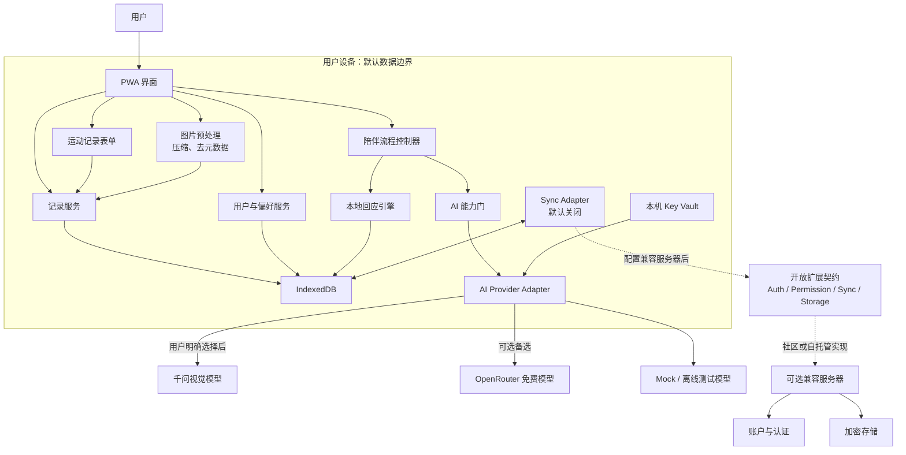
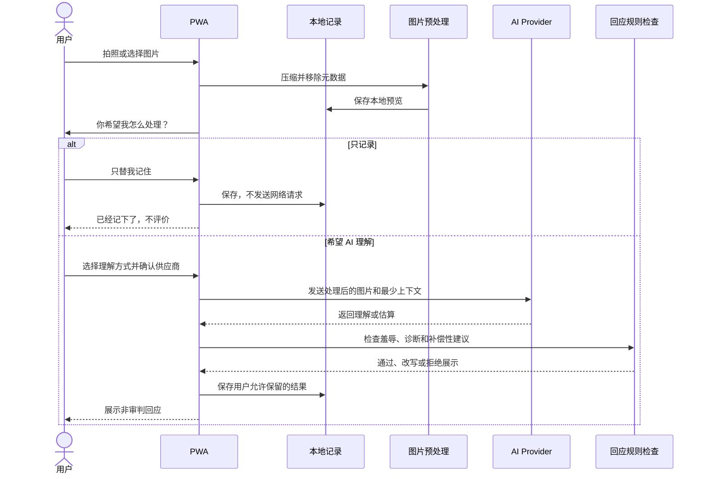
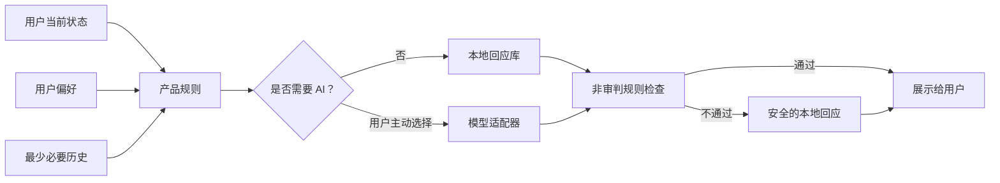
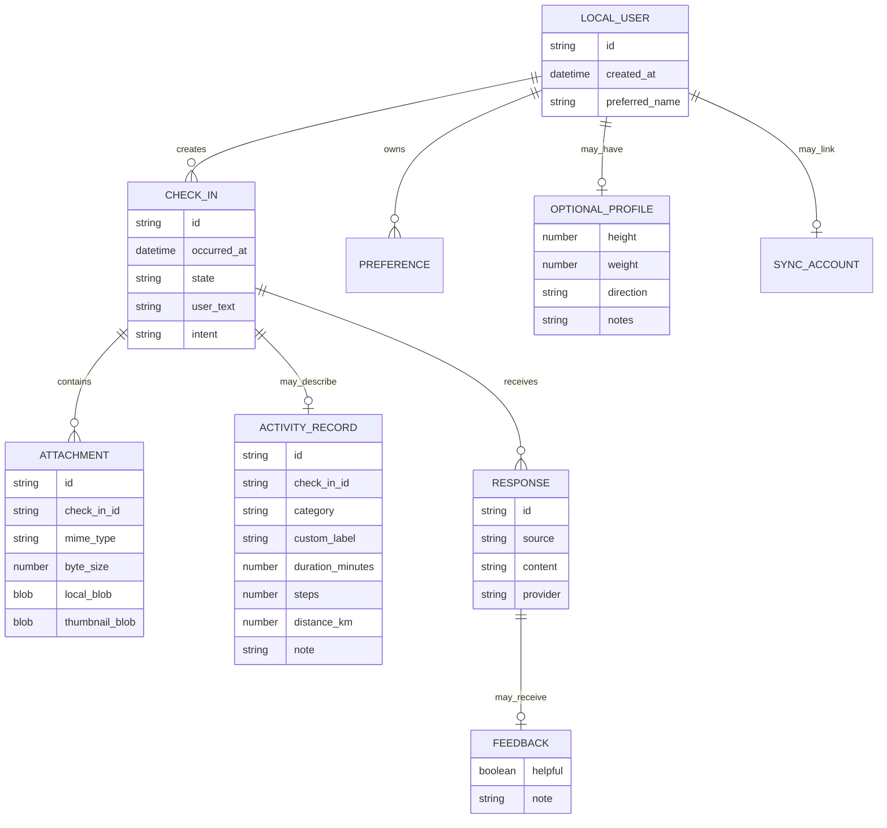

# 架构图

## 0. 当前阶段

- 阶段 0 已于 2026-07-10 验收通过。
- 阶段 1 已于 2026-07-10 验收通过。
- 阶段 2 已开始纯本机照片切片：图片处理、附件存储、时间线回看和删除属于本机能力；Provider、Key 与图片理解尚未接入。
- 阶段 3 本机运动记录已完成候选实现：独立表单、本机写入、摘要展示和 v3 导出分别维护，等待用户体验验收。
- 真实 Provider、Key 与图片理解明确排在阶段 3 验收之后。
- 官方核心长期只实现离线与 BYOK 两条路径；服务器、账户、权限、云存储和同步只维护开放契约，不成为默认依赖。
- 本文描述的是完整演进架构，不代表后续 AI 与开放扩展模块已经实现。阶段 1 的实施证据见 [`04-阶段1设计.md`](04-阶段1设计.md)，本机照片边界见 [`06-阶段2设计.md`](06-阶段2设计.md)，本机运动记录边界见 [`07-阶段3运动记录设计.md`](07-阶段3运动记录设计.md)。

## 1. 总体架构

第一版采用本地优先架构。PWA 是完整应用，AI 和云端同步都是可插拔能力。



核心约束：

- PWA 不连接任何外部服务，也能完成基础陪伴和记录。
- 图片只有在用户明确选择 AI 理解时才离开设备。
- 未配置服务器时不展示登录或同步入口，也不发送相关网络请求。
- 兼容服务器不可用不影响本地使用和 BYOK AI。
- AI 输出必须经过产品规则检查后才能展示。

## 2. 模块职责

### PWA 界面

- 展示四个核心状态入口。
- 收集用户当前意图。
- 明确区分“只记录”和“交给 AI 理解”。
- 不直接操作模型或数据库。

### 陪伴流程控制器

- 决定当前体验处于哪条分支。
- 优先调用本地回应引擎。
- 只有在用户主动请求时才开启 AI 能力门。
- 将模型结果交给安全规则检查。

### 本地回应引擎

- 无网络可运行。
- 使用人工编写、审核过的回应。
- 根据用户偏好调整称呼、长度和语气。
- 避免近期重复，不假装拥有专业医疗判断。

### 记录服务

- 保存文字、状态、用户意图和回应。
- 保存本地图片或图片引用。
- 以独立详情表保存可选的活动类型、时长、步数、距离和备注。
- 提供时间线、导出和删除。
- 不计算连续打卡和完成率。

### 运动记录功能

- 表单组件只收集输入并声明每一项都可跳过。
- 本机适配器只调用记录服务，不导入 Provider、账户、云端或网络能力。
- 展示模块只把活动类别和可选数字整理成时间线摘要。
- v3 导出模块只组合本机记录、照片索引与运动详情。
- 依赖方向固定为 `页面 → 运动功能 → 本机数据`，不反向引用界面。

### 用户与偏好服务

- 管理本机匿名身份。
- 保存可选资料和表达偏好。
- 保存用户明确认可或不喜欢的回应方式。
- 登录后负责本机身份与云端身份的合并。

### AI Provider Adapter

- 统一模型请求和返回格式。
- 隔离不同供应商的接口差异。
- 支持能力检测：文本、图片、结构化输出。
- 模型失败时返回可识别错误，由流程控制器降级。

### Sync Adapter

- 官方核心只提供接口、关闭态实现和一致性测试，不提供必须部署的同步服务器。
- 只有用户配置兼容服务器并主动登录后，才上传允许同步的数据。
- 支持增量同步、冲突保留和删除传播。
- 不同步模型 Key。

### 开放扩展契约

- 定义兼容服务器的能力发现、账户、认证、权限、同步、云存储、导出和删除语义。
- 使用稳定编号、规范关键词、OpenAPI、JSON Schema、有效示例和一致性用例。
- 同一份规范同时面向人类开发者与 AI Agent，禁止依靠未写明的隐含约定。
- 社区实现可以选择不同技术栈，但必须通过相同的契约测试。
- 详细格式和兼容边界见 [`05-开放扩展接口规范.md`](05-开放扩展接口规范.md)。

## 3. 拍照数据流



## 4. 回应生成架构



产品规则优先于模型。模型不能把产品重新变成热量裁判或健身教练。

## 5. 数据实体关系



身体资料与用户身份分开存放，因为它们不是使用产品的必要条件。

当前 Dexie v3 已实现 `ATTACHMENT` 的本机 Blob 与缩略图，以及可空的 `ACTIVITY_RECORD` 运动详情；`RESPONSE` 的 AI 来源、`FEEDBACK`、资料、账户和同步实体仍是未来架构，不代表已建表。照片是否发送给 AI 属于每次请求的授权事件，不在附件上预埋永久授权布尔值。

## 6. 部署形态

### 第一阶段

```text
GitHub 源代码
  └── 静态 PWA 托管
        └── 用户设备上的 IndexedDB
```

没有自有业务后端。部署失败不会导致已有本地记录丢失。

### 配置兼容服务器后

```text
静态 PWA
  ├── 可选 AI 服务（用户 Key）
  └── 可选兼容服务器
        ├── 认证
        ├── 权限
        ├── 同步与云存储
        └── 账户导出与删除
```

兼容服务器由社区、自托管者或第三方实现。官方核心只维护客户端适配器、规范和一致性测试。

### 加入原生安装后

```text
同一套 Web 核心
  ├── PWA
  ├── Capacitor Android
  └── Capacitor iOS
```

## 7. 必须守住的架构边界

- 无 Key 路径不能意外调用模型。
- “只记录”路径不能上传图片。
- 身高体重为空不能导致任何核心页面报错。
- 登录和同步模块不能成为 App 启动依赖。
- 未配置兼容服务器时不能出现账户请求、同步请求或隐藏遥测。
- 兼容服务器不能接收、同步或记录用户的模型 Key。
- 模型 Key 不进入同步、崩溃报告或分析日志。
- AI 供应商可以替换，陪伴规则不能由供应商决定。
- 专业课程、社区和排行榜不进入核心模块。
