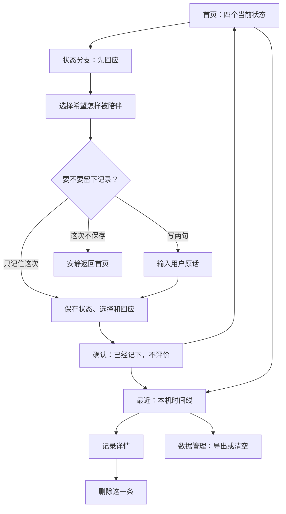
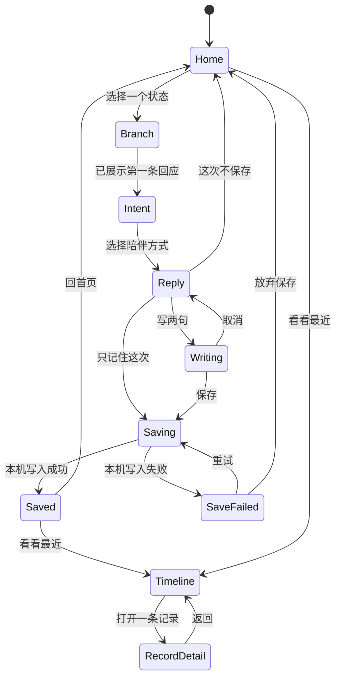

# 阶段 1 设计：本地优先 MVP

## 1. 当前状态

- 设计版本：v1
- 进入日期：2026-07-10
- 前置条件：阶段 0 手机端交互原型已验收通过
- 当前状态：设计中，尚未开始实现

本设计把已经验证过的四条陪伴流程变成一个不依赖账户、模型或云端的本机完整产品。重点不是增加更多功能，而是让用户的真实表达能够被可靠地留在自己的设备上。

## 2. 本阶段目标

用户首次打开后，无需登录、填写资料或连接模型，即可完成以下闭环：

1. 从四个状态入口中选择一个。
2. 先得到一条本地、非审判回应。
3. 可选写两句，也可以只保存状态和选择。
4. 将记录保存在当前设备。
5. 在时间线中重新看到这次经历。
6. 可删除单条记录、导出全部数据或清空本机数据。
7. 安装为 PWA，并在首次加载后断网完成同一套基础体验。

阶段 1 的产品判断标准仍然是“能不能接住用户”，不是“能不能收集更多数据”。

## 3. 明确范围

### 3.1 本阶段要做

- 保留阶段 0 的四个核心入口和现有非审判语气。
- 首次使用时自动建立本机匿名身份，不展示注册或资料表。
- 使用 IndexedDB + Dexie 保存结构化数据。
- 使用人工审核的本地回应库，不调用模型。
- 支持可跳过的文字记录。
- 支持最近记录时间线。
- 支持单条删除、JSON 导出和清空全部本机数据。
- 提供 PWA Manifest、资源缓存和离线启动能力。
- 支持手机窄屏、大字号、键盘操作和减少动态效果偏好。
- 为数据库升级、核心流程和禁止项建立自动化检查。

### 3.2 本阶段不做

- 照片拍摄、图片保存、EXIF 处理或图片识别。
- 千问、OpenRouter、Mock Provider 或任何真实/模拟 AI 对话入口。
- 模型 Key 输入、验证、保存或加密。
- 登录、账户、邮箱魔法链接、通行密钥或工作区身份；允许维护独立开放契约，但不实现、不打包。
- 云数据库、同步、换机恢复或多设备合并；允许维护独立开放契约，但不改变阶段 1 运行时。
- 身高、体重、年龄、目标体重或热量预算。
- 周报、趋势图、连续打卡、完成率、排行榜或行为分析。
- 推送通知、埋点、广告和第三方统计脚本。

## 4. 体验结构

### 4.1 页面地图

阶段 1 保持轻量双入口结构，不把首页改成数据看板：



### 4.2 首页

保留阶段 0 的首屏和四张状态卡。只增加一个低权重辅助入口：

- `看看最近发生了什么`

首页不展示记录数量、连续天数、体重变化或“今天还没记录”的提醒。

### 4.3 分支与记录

阶段 0 的“先回应、再选择”保持不变。在最终回应之后增加三个平级动作：

- `只记住这次`
- `写两句再记住`
- `这次不保存`

“写两句”打开同页输入层，默认不聚焦、不强迫填写，文案为：

> 如果你愿意，可以把刚才没说完的留在这里。

保存成功只确认事实：

> 已经记下了。这里不需要给今天打分。

### 4.4 最近记录

时间线按发生时间倒序排列，每条记录只呈现：

- 自然时间，如“今天 21:30”“昨天”“7 月 8 日”。
- 当时状态，如“今天选择休息”。
- 用户原话摘要；为空时不显示占位批评。
- 当时选择和本地回应。

不使用红绿状态、完成勾选、连续天数、成功/失败标签或热量统计。

空时间线文案：

> 这里还没有记录。你可以先去首页坐一会儿，也可以什么都不做。

### 4.5 删除、导出与清空

- 单条删除：从记录详情发起，二次确认后立即从 IndexedDB 删除。
- JSON 导出：导出产品版本、schema 版本、导出时间、本机身份创建时间和全部记录；不包含设备指纹或其他隐藏标识。
- 清空本机数据：明确说明会删除本机身份和全部记录；二次确认后清空数据库并重新生成匿名身份。
- 阶段 1 没有云端副本，因此所有数据操作都只影响当前设备。

导出结构固定为：

```ts
type LocalExportV1 = {
  product: "减肥拍拍乐";
  exportVersion: 1;
  schemaVersion: 1;
  exportedAt: string;
  localUser: {
    id: string;
    createdAt: string;
  };
  checkIns: CheckInV1[];
};
```

## 5. 交互状态机



写入失败时不使用“你操作有误”，而是说明“这次没有成功留在本机”，允许重试或不保存离开。

## 6. IndexedDB v1 数据模型

阶段 1 只建立当前确实需要的数据表，不预建照片、模型、账户或同步字段。

### 6.1 `local_users`

| 字段 | 类型 | 说明 |
| --- | --- | --- |
| `id` | string | 浏览器端生成的随机 UUID |
| `createdAt` | ISO datetime | 本机身份创建时间 |
| `schemaVersion` | number | 当前为 `1` |

每个浏览器资料默认只有一条本机用户记录。这个 ID 不发送到任何服务。

### 6.2 `check_ins`

| 字段 | 类型 | 说明 |
| --- | --- | --- |
| `id` | string | 记录 UUID |
| `localUserId` | string | 所属本机匿名身份 |
| `occurredAt` | ISO datetime | 用户确认保存的时间 |
| `state` | enum | `food` / `rest` / `tired` / `visit` |
| `intentId` | string | 用户选择的陪伴方式 ID |
| `userText` | string 或 null | 用户原话，可空 |
| `responseKey` | string | 本地回应库稳定键 |
| `responseText` | string | 当时实际展示的回应快照 |
| `helpful` | boolean 或 null | 可选反馈；阶段 1 不主动追问 |

保留 `responseText` 快照，避免回应库升级后篡改历史体验。

### 6.3 索引与迁移

- `check_ins` 按 `[localUserId+occurredAt]` 建联合索引，支持倒序时间线。
- 所有表通过 Dexie version `1` 创建。
- 任何后续字段变化必须新增数据库版本和迁移，不直接修改已发布的 v1 定义。
- 测试至少覆盖从空库初始化、重复启动、写入、删除、导出和清空。
- 阶段 1 不创建偏好、身体资料、附件、模型、账户或同步表；需要时再通过新版本迁移加入。

## 7. 本地回应引擎

### 7.1 输入与输出

```ts
type LocalResponseInput = {
  state: "food" | "rest" | "tired" | "visit";
  intentId: string;
  recentResponseKeys: string[];
};

type LocalResponse = {
  key: string;
  text: string;
};
```

### 7.2 选择规则

1. 先按 `state + intentId` 找到人工审核的候选集合。
2. 排除最近三次已经展示的 `responseKey`。
3. 若全部被排除，则从最早使用的候选重新开始。
4. 没有匹配项时返回该状态的安全兜底回应。
5. 不根据体重、热量、连续使用天数或“表现”调整语气。

这套轮换规则可预测、可测试，不依赖随机数，也不伪装成 AI。

### 7.3 文案门槛

回应库必须通过人工审核和自动化敏感词回归检查，重点阻止：

- 羞辱、恐吓和道德评价。
- “必须坚持”“不能偷懒”等强制服从语气。
- 因吃东西而建议补偿运动或节食。
- 医疗诊断、治疗承诺或专业饮食处方。
- 把散步、逛街或家务包装成等价训练的虚假说法。

自动化检查只负责发现风险词，不替代人工语境判断。

## 8. 模块边界

```text
app/
  page.tsx                 四入口与页面编排
  manifest.ts              PWA Manifest
features/
  check-in/                状态分支、意图、文字记录与保存
  timeline/                时间线、详情与删除
  data-management/         JSON 导出与清空
lib/
  db/                      Dexie schema、迁移与仓储接口
  responses/               人工回应库与选择规则
  identity/                本机匿名身份
  export/                  稳定的导出格式
public/
  icons/                   PWA 图标
  sw.js                    资源缓存与离线壳
```

约束：

- React 页面不直接操作 IndexedDB，统一经过仓储接口。
- 回应库不读取数据库，只接收最少必要输入。
- 数据导出只读取本机仓储，不调用网络。
- Service Worker 只缓存应用壳与静态资源，不缓存用户记录。
- 阶段 1 不创建 API Route、服务端写入接口或第三方请求。
- 开放扩展规范独立维护，阶段 1 代码不得导入或依赖服务器实现。

## 9. 离线与 PWA 策略

- 首次联网访问时缓存应用壳、样式、脚本、字体和图标。
- 再次打开时优先使用缓存壳，后台检查静态资源更新。
- 用户记录始终来自 IndexedDB，不进入 Cache Storage。
- 更新失败不阻断当前版本使用。
- 新版本就绪后使用温和提示，由用户主动刷新，不强制中断正在填写的文字。
- 安装提示不抢占首次体验；用户至少完成一次核心流程后才展示低权重引导。

阶段 1 的“离线可用”指首次成功加载后，在飞行模式下仍能进入四个入口、得到本地回应、保存文字记录、查看时间线、导出和清空本机数据。

## 10. 错误与恢复设计

| 场景 | 用户看到的内容 | 恢复动作 |
| --- | --- | --- |
| IndexedDB 不可用 | 这次暂时不能留在本机，但仍可继续看回应 | 重试或不保存离开 |
| 单条保存失败 | 这次没有成功记住 | 保留输入并重试 |
| 导出失败 | 暂时没有生成文件，本机记录没有变化 | 重试 |
| 清空失败 | 没有全部清空，不显示成功状态 | 重试并保留当前页面 |
| PWA 更新失败 | 不打扰用户 | 继续使用缓存版本 |

任何技术错误都不能转化为对用户行为的评价。

## 11. 实施切片

### 切片 A：本机基础设施

- Dexie v1 schema 和仓储接口。
- 自动建立本机匿名身份。
- 数据库初始化、升级和失败状态。
- 单元测试覆盖空库、重复启动和迁移边界。

完成标志：刷新后本机身份稳定存在，但页面体验尚不宣称阶段 1 完成。

### 切片 B：保存闭环

- 将阶段 0 的四条分支接入本地回应引擎。
- 增加“只记住”“写两句”“不保存”。
- 保存成功与失败反馈。

完成标志：四条分支都能在无 Key 路径保存一条真实记录。

### 切片 C：时间线与数据控制

- 最近记录、详情和单条删除。
- JSON 导出。
- 清空本机数据并重建匿名身份。

完成标志：用户能查看、带走和彻底删除自己的本机数据。

### 切片 D：PWA 与离线

- Manifest、应用图标和 Service Worker。
- 应用壳缓存、更新提示和安装引导。
- 飞行模式完整链路验证。

完成标志：首次加载后断网仍可完成保存、查看和删除。

### 切片 E：阶段验收

- 手机窄屏、大字号、键盘和减少动态效果验证。
- 禁止文案与禁止网络请求回归检查。
- 数据升级、导出和清空验证。
- 真机完整链路人工验收。

完成标志：满足第 12 节全部验收条件后，才将阶段 1 标记为通过。

## 12. 验收矩阵

| 编号 | 验收条件 | 证据 |
| --- | --- | --- |
| S1-01 | 首次使用不出现登录、资料或 Key 页面 | 真机流程记录 |
| S1-02 | 四个状态均能得到本地回应并可选择不保存 | 自动化流程测试 |
| S1-03 | 用户原话可空，空值不阻断保存 | 单元测试 + 页面测试 |
| S1-04 | 刷新和重新打开后记录仍存在 | IndexedDB 集成测试 |
| S1-05 | 时间线不出现评分、连续天数、红绿状态或完成率 | 文案回归检查 |
| S1-06 | 单条删除后不可再次读取 | 仓储测试 |
| S1-07 | 导出 JSON 与本机数据一致 | 导出快照测试 |
| S1-08 | 清空后旧身份和记录均不可读取 | 集成测试 |
| S1-09 | 首次加载后断网仍可回应、保存、查看、导出和清空 | 真机飞行模式验证 |
| S1-10 | 业务数据不发送到网络，不加载第三方统计脚本 | 网络请求检查 |
| S1-11 | 360px 窄屏和 200% 字号下核心操作可达 | 视觉验收 |
| S1-12 | 本地写入失败时保留用户已输入文字并允许重试 | 故障注入测试 |

## 13. 设计完成门槛

进入阶段 1 实现前，需要确认以下设计没有互相冲突：

- 四条原型流程的文案和节奏保持不变，只增加可选记录动作。
- 时间线是记忆，不是成绩单。
- 本机匿名身份不会演变成隐性登录。
- IndexedDB v1 不预埋偏好、身体资料、照片、AI、账户和同步字段。
- 开放扩展契约不改变阶段 1 的本机数据模型和离线验收条件。
- PWA 离线能力不依赖后端。
- 删除、导出和清空是阶段内能力，不留给未来账户系统补做。

设计通过后，从“切片 A：本机基础设施”开始实施，不并行展开阶段 2 能力。
