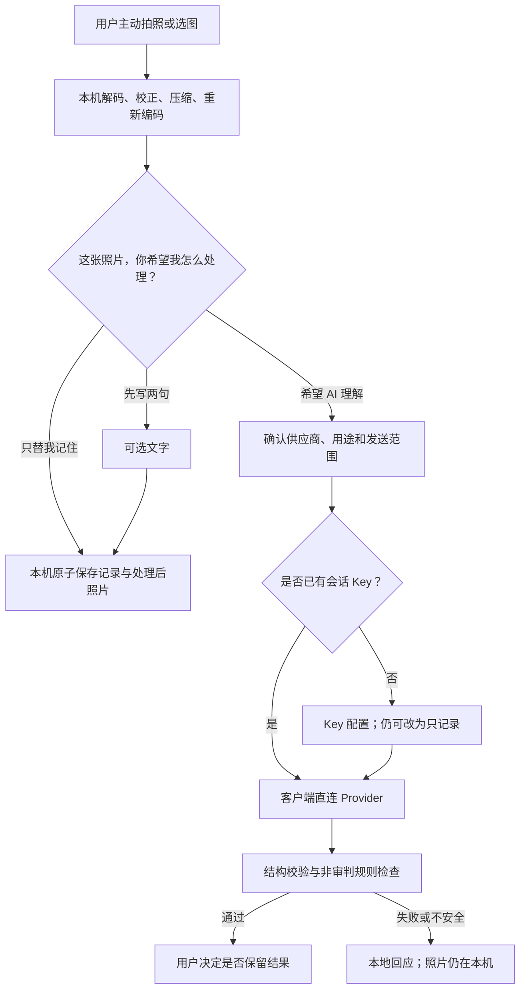

# 阶段 2 设计：照片记录与 BYOK

## 0. 当前状态

- 阶段 1 已由用户于 2026-07-10 验收通过。
- 阶段 2 的第一切片“纯本机照片闭环”已完成候选实现，不接真实模型，不要求 Key。
- 本文同时约束后续 BYOK 切片，但计划中的 Provider、Key Vault 和图片理解不代表已经实现。

## 1. 阶段目标

阶段 2 增加两种彼此独立的能力：

1. 用户可以拍照或选择图片，在设备端完成方向处理、压缩和元数据移除，然后只保存在本机。
2. 用户主动选择 AI 理解并明确确认后，客户端才可以使用用户自己的 Key 直连经过审核的模型供应商。

AI 是附加解释层，不能成为照片保存、文字记录、本地回应、时间线、导出或删除的前置条件。

## 2. 明确不做

- 不做账户、登录、权限、云存储、云同步或项目自有模型代理。
- 不把 AI 放到首页主入口，不在首次打开时展示 Key 配置。
- 不自动识别照片，不把相机权限视为发送授权。
- 不保存原始照片、文件名、EXIF、GPS、设备型号或持久化 Object URL。
- 不把 Mock Provider 暴露为面向用户的“免费 AI”；Mock 只用于测试。
- 不生成单点精确热量、食物好坏评分、红色超标提示、补偿运动或补偿节食建议。
- 不在启动时远程拉取模型列表或配置；Provider 配置随应用版本发布。

## 3. 核心体验

四个情绪入口继续是首页主角。照片只作为四入口之后的辅助工具行：

> 拍一张，先放在这里  
> 可以只保存在本机，不识别，也不发送

“想吃点东西”分支中的“我想拍下来，但不要算热量”直接进入同一流程。



第一切片只实施 `A → B → C → D/E`。

## 4. 页面与文案

### 4.1 本机照片页

- 空态标题：`拍一张，先放在这里`。
- 说明：`可以只保存在本机，不识别。`
- 用户动作：`拍照或选择图片`、`还是写两句`、`取消`。
- 相机或相册权限只能在用户点击后请求。

### 4.2 处理后预览

- 主动作：`只替我记住`。
- 主动作说明：`不识别，也不会发送出去`。
- 次动作：`写两句再记住`、`重新选一张`、`删除这张照片`。
- 图片使用 0–4px 圆角，不使用悬浮相框或大卡片。

### 4.3 时间线与详情

- 时间线使用 64–72px 方形缩略图，不展示热量或评分。
- 详情页展示本机处理后的图片和说明：`没有被识别或发送`。
- 删除记录时必须在同一事务删除主图、缩略图和引用。

### 4.4 后续 AI 结果

AI 结果使用编辑式报告段落，不使用聊天气泡或仪表盘：

1. `先说一句`：先解除好坏判断。
2. `我大概看到`：使用“看起来像”“可能有”。
3. `不确定的地方`：明确份量、烹饪油和隐藏配料无法从照片精确判断。
4. 只有用户主动要求时显示 `一个很宽松的参考范围`。

模型失败统一留在当前页面：

> 这次模型没有回应。照片和你写的话都还在本机。

## 5. 图片处理契约

- `P2-IMG-001 MUST`：原始文件不得写入 IndexedDB、Cache Storage、导出或 Provider 请求。
- `P2-IMG-002 MUST`：输入必须在本机解码后通过 Canvas 或等价像素表面重新编码，以移除 EXIF、GPS、IPTC 和 XMP。
- `P2-IMG-003 MUST`：第一版只接受浏览器可稳定解码的 JPEG、PNG 和 WebP；HEIC 等不支持格式必须温和失败。
- `P2-IMG-004 MUST`：输入文件上限为 20MiB，解码像素上限为 4000 万，主图最长边不超过 1600px。
- `P2-IMG-005 MUST`：主图目标不超过 1.5MiB，缩略图最长边为 360px；不得为了达标无限降质。
- `P2-IMG-006 MUST`：处理失败时不得保存或发送未经处理的原图。
- `P2-IMG-007 MUST`：页面结束使用 Blob URL 后必须撤销 URL。

## 6. 本机数据 v2

继续使用数据库名 `jianfei-paipai-le-stage1`，通过 Dexie `version(2)` 原地迁移。重命名数据库会让旧记录看起来消失，禁止这样做。

阶段 1 的 `check_ins` 字段保持不变，新增 `attachments`：

```ts
type LocalImageAttachmentV1 = {
  id: string;
  localUserId: string;
  checkInId: string;
  createdAt: string;
  mediaType: "image";
  mimeType: "image/jpeg" | "image/webp";
  blob: Blob;
  byteSize: number;
  width: number;
  height: number;
  thumbnailBlob: Blob;
  thumbnailMimeType: "image/jpeg" | "image/webp";
  thumbnailByteSize: number;
  thumbnailWidth: number;
  thumbnailHeight: number;
  processingVersion: 1;
};
```

- `P2-DATA-001 MUST`：v1→v2 迁移不得修改或丢失旧 `check_ins`。
- `P2-DATA-002 MUST`：记录与照片必须在同一事务写入。
- `P2-DATA-003 MUST`：单条删除和全部清空必须删除附件，不留孤儿 Blob。
- `P2-DATA-004 MUST`：照片空间不足不能让用户已写文字消失。
- `P2-DATA-005 MUST`：应用不得自动删除最旧照片；空间管理由用户决定。
- `P2-DATA-006 MUST`：Key 永远不进入本机记录导出。

第一切片保留阶段 1 JSON 导出，并新增不含二进制的附件索引。包含照片文件的版本化 ZIP（`manifest.json + attachments/`）是下一切片的必做项，未完成前页面必须明确说明限制。

## 7. 只记录零网络门

```ts
type PhotoDecision =
  | { kind: "record_only" }
  | {
      kind: "ai";
      providerId: string;
      intent: "food_understanding" | "calorie_range";
    };
```

- `P2-NET-001 MUST`：`record_only` 模块不得导入 Provider 或包含网络原语。
- `P2-NET-002 MUST`：存在 Key、网络在线或 Service Worker 激活都不能改变“只记录”零请求行为。
- `P2-NET-003 MUST`：Service Worker 不得缓存用户照片、模型请求、模型响应或 Key。
- `P2-NET-004 MUST`：模型请求只能发生在照片已经本机保存且用户再次确认发送之后。
- `P2-NET-005 MUST`：外发内容默认只包含处理后照片、当前状态、当前意图和本次必要文字。

## 8. 后续 Provider 契约

```ts
interface AIProvider {
  readonly descriptor: ProviderDescriptor;
  validateCredential(input: CredentialInput): Promise<CredentialValidation>;
  respond(input: ConversationInput): Promise<CompanionResponse>;
  understandImage(input: ImageUnderstandingInput): Promise<ImageUnderstanding>;
}
```

`ProviderDescriptor` 必须声明 Provider ID、展示名称、浏览器直连能力、文本/视觉/结构化输出能力、图片格式和大小限制、随应用发布的模型清单版本、隐私政策链接。

- `P2-AI-001 MUST`：官方适配器只能接入经过真实浏览器 CORS 验证的直连 Provider。
- `P2-AI-002 MUST`：不支持浏览器直连的 Provider 不得通过临时项目代理进入官方核心。
- `P2-AI-003 MUST`：模型和端点配置随应用版本发布，不在启动时远程拉取。
- `P2-AI-004 MUST`：图片请求可能计费，失败时不得隐式自动重试。
- `P2-AI-005 MUST`：模型输出先经过结构校验和非审判规则检查；失败时回退本地回应。
- `P2-AI-006 MUST`：原始模型响应、完整 Prompt、请求头、Key 和失败响应体不得持久化。

当前官方资料表明：阿里云百炼的 OpenAI 兼容视觉接口和 OpenRouter 多模态接口都支持图片输入，Base64 可用于不公开的本地图片；具体模型、区域端点、大小限制、费用和浏览器 CORS 仍属于易变化事实，接入前必须重新验证。[阿里云视觉理解](https://help.aliyun.com/zh/model-studio/vision)、[阿里云 OpenAI 兼容视觉接口](https://help.aliyun.com/en/model-studio/qwen-vl-compatible-with-openai)、[OpenRouter 多模态说明](https://openrouter.ai/docs/guides/overview/multimodal/overview)

## 9. Key 生命周期

第一版 BYOK 默认只提供会话 Key：刷新或关闭即清除，不写入 IndexedDB、Local Storage、URL、Cookie、日志、缓存或导出。

后续可选“记住在本机”必须明确区分：

1. 便利模式：Web Crypto 加密后保存，只能降低明文检查风险，不能抵御同源恶意脚本或设备失窃。
2. 口令模式：PBKDF2 派生 AES-GCM 密钥，每次重新打开需要用户解锁；不保存口令或派生密钥。

标准 PWA 没有可普遍依赖的系统 Keychain，界面不得把普通 Web Crypto 描述成“绝对安全”或“银行级安全”。OpenRouter 官方也要求 API Key 不得提交到公开仓库，暴露后应立即删除并轮换。[OpenRouter API 认证](https://openrouter.ai/docs/api/reference/authentication)

## 10. 实施切片

| 切片 | 内容 | 状态 |
| --- | --- | --- |
| A | IndexedDB v2、图片本机处理、只记录、时间线、详情、级联删除 | 候选完成 |
| B | 容量预检、持久存储请求、含照片 ZIP 导出、权限与格式恢复 | 待实施 |
| C | Provider 契约、AI Gateway、会话 Key、真实浏览器直连验证 | 待实施 |
| D | 明确发送确认、图片理解、安全检查、结果保留控制 | 待实施 |
| E | 一次有界追问与用户明确保存的表达偏好 | 待实施 |

自由对话和回应偏好记忆属于阶段 2 后半切片，不阻塞照片与 BYOK 主链。

## 11. 阶段 2 通过条件

| ID | 条件 | 证据 |
| --- | --- | --- |
| P2-01 | 无 Key 也能拍照、保存、查看、删除和导出 | 自动化 + 真机 |
| P2-02 | “只记录”在所有状态下零网络 | 失败网络桩 + 网络面板 |
| P2-03 | 处理后图片不含 EXIF/GPS | 元数据夹具扫描 |
| P2-04 | v1 升级后身份和旧记录不丢 | Dexie 迁移测试 |
| P2-05 | 空间不足保留当前照片草稿和文字 | 故障注入 |
| P2-06 | 删除和清空不留孤儿附件 | 事务测试 |
| P2-07 | Key 不出现在日志、缓存、导出或错误 | 秘密扫描 |
| P2-08 | 每次发送前明确显示供应商和数据范围 | 页面测试 + 人工复核 |
| P2-09 | 401/403/429、超时、断网、CORS 和畸形结果不丢本机记录 | Provider 故障测试 |
| P2-10 | 不安全模型结果不展示、不持久化并回退本地回应 | 安全规则回归 |
| P2-11 | 热量只在用户主动要求时以宽范围出现 | 文案与流程测试 |
| P2-12 | 飞行模式下完成纯本机照片闭环 | PWA 真机测试 |
| P2-13 | 360/390px、200% 字号、键盘和读屏操作可达 | 可访问性验收 |
| P2-14 | 没有登录、云存储、项目模型代理、遥测或隐藏配置请求 | 静态边界测试 |

阶段 2 只有在以上条件全部满足且用户完成主观体验验收后才标记通过。

## 12. 第一切片实施证据

- 同名 IndexedDB 已增加 v2 附件表，v1 身份与旧记录原地迁移。
- 图片处理器在浏览器本机完成解码、最长边限制、重新编码和缩略图生成。
- `record-only` 模块与 Provider 隔离，不包含网络原语。
- 首页四个情绪入口保持不变，照片作为其后的辅助工具行。
- 本机照片可进入时间线缩略图和详情页；单条删除与全部清空级联删除附件。
- Service Worker 只缓存应用壳和构建资源，明确排除 Blob/Data 与跨域请求。
- 43 项自动化测试通过；390×844 照片空态与辅助入口无横向溢出，触控区不小于 44px。
- 浏览器的原生相机/相册选择、真实图片重新编码和回看仍需真机体验确认，因此本切片保持候选状态。
