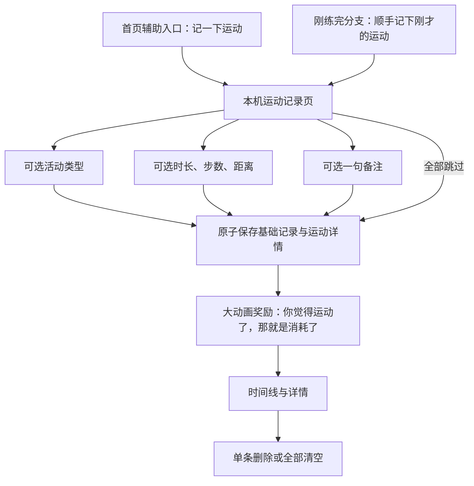

# 阶段 3 设计：本机运动记录

## 0. 当前状态

- 本机运动记录已于 2026-07-11 通过用户手机端主观体验验收。
- 运动保存后已增加专属奖励页：用大幅 CSS 动画庆祝“这次动过”，不发积分、不评价强度。
- 本轮不接 Provider、Key、图片理解、自由对话、账户、云同步或遥测。
- 阶段 3 已通过，可以进入真实大模型接入。

## 1. 产品目标

运动记录是生活记录，不是新的考核系统。

用户可以从首页辅助工具进入，也可以在“我刚练完，很累”分支中选择“顺手记下刚才的运动”。两处进入同一页面，四个情绪入口仍然是首页主角。

可以记录：

- 活动类型：走路、跑步、力量训练、骑行、游泳、球类、拉伸或瑜伽、其他。
- 时长、步数和距离。
- 一句可选备注。

以上每一项都能跳过。用户可以只留下“我动过了”，不需要为了保存而补齐数据。

## 2. 明确不做

- 不把运动记录变成首页第五个核心状态。
- 不计算连续天数、完成度、排名、热量赤字或运动好坏。
- 不根据一次运动生成补偿饮食或追加训练建议。
- 不自动读取系统健康数据、定位或传感器。
- 不连接模型、账户、云端或分析服务。
- 不在本阶段加入训练课程、动作教学或训练计划。

## 3. 体验链路



奖励页庆祝的是“这次动过”本身，不庆祝达标，也不评价运动强度。若用户填了类型、时长、步数或距离，页面会把那一条真实记录放在奖励文案下面；若全部跳过，也只说“这一下算数”，不要求补数据。

## 4. 奖励、图表与模型的拆分

### 4.1 当前切片：先给奖励

- 运动保存后进入独立的 `ActivityReward` 页面。
- 主文案：`你觉得运动了，那就是消耗了。`
- 动画使用本机 CSS 光环、放射线和纸片，不加载远程素材或运行自定义绘图循环。
- `prefers-reduced-motion` 下关闭旋转、扩散和纸片动画，保留完整文案与按钮。

### 4.2 后续切片：有记录后再画图

- 图表只读取本机 `activity_records`，不依赖模型或账户。
- 没填的时长、步数和距离保持空缺，不用 `0` 冒充真实数据。
- 不画连续天数、完成率、排名或目标线；默认一次只看一种指标，避免把不同单位拼成总分。
- 图表的语气是“这些运动留下了痕迹”，不是“你完成得够不够”。

### 4.3 阶段 4：接入模型后再问消耗

- 只有用户已连接模型并主动选择时，才出现“想估个大概消耗吗”。
- 结果使用宽松范围并说明不确定性，不给单点精确数字。
- 估算是可选附注，不覆盖用户原始运动记录，也不自动生成补偿饮食或追加训练建议。

## 5. 本机数据 v3

继续使用数据库名 `jianfei-paipai-le-stage1`，通过 Dexie `version(3)` 原地迁移。v1 的 `check_ins` 和 v2 的 `attachments` 保持不变，新增 `activity_records`：

```ts
type ActivityRecordV1 = {
  id: string;
  localUserId: string;
  checkInId: string;
  createdAt: string;
  category:
    | "walking"
    | "running"
    | "strength"
    | "cycling"
    | "swimming"
    | "ball"
    | "stretching"
    | "other"
    | "unspecified";
  customLabel: string | null;
  durationMinutes: number | null;
  steps: number | null;
  distanceKm: number | null;
  note: string | null;
};
```

数据约束：

- `P3-DATA-001 MUST`：v1/v2 升级到 v3 不得丢失身份、文字记录或照片附件。
- `P3-DATA-002 MUST`：基础 `check_ins` 与 `activity_records` 必须在同一事务写入。
- `P3-DATA-003 MUST`：单条删除和全部清空必须级联删除运动详情。
- `P3-DATA-004 MUST`：运动详情进入 JSON v3 导出；照片二进制仍不进入 JSON。
- `P3-DATA-005 MUST`：时长、步数和距离只接受正数并设置合理上限，非法输入不得留下半条记录。

## 6. 简单职责边界

代码依赖保持单向：

```text
app/page.tsx
  -> app/activity-flow.tsx
  -> app/activity-reward.tsx
  -> lib/stage3/*
  -> lib/stage1/*（本机数据基础）
```

- `app/activity-flow.tsx`：只负责表单交互和可访问性。
- `app/activity-flow.css`：只负责运动记录页样式。
- `app/activity-reward.tsx` 与 `app/activity-reward.css`：只负责保存后的奖励文案、动画和去向按钮。
- `lib/stage3/record-activity.ts`：只负责本机运动记录入口，不包含网络能力。
- `lib/stage3/storage.ts`：只负责运动字段校验、原子保存和按时间读取。
- `lib/stage3/presentation.ts`：只负责活动名称与摘要格式。
- `lib/stage3/export.ts`：只负责 v3 JSON 导出。
- `lib/stage1/types.ts` 与 `lib/stage1/db.ts`：集中维护本机持久化契约、迁移和事务。
- `app/page.tsx`：只串联页面状态、时间线和详情，不保存字段校验或数据库实现。

不为本阶段创建通用表单框架、仓库层或服务容器；当前职责单元保持小而直接。

## 7. 验收条件

| ID | 条件 | 证据 |
| --- | --- | --- |
| P3-01 | 首页辅助入口和“刚练完”分支都能进入运动记录 | 页面 + 人工体验 |
| P3-02 | 类型、时长、步数、距离、备注全部可以跳过 | 页面 + 自动化 |
| P3-03 | 保存后刷新仍能在时间线和详情中查看 | IndexedDB + 人工体验 |
| P3-04 | v1/v2 升级到 v3 不丢旧记录 | 迁移测试 |
| P3-05 | 保存失败不产生孤儿基础记录或运动详情 | 事务测试 |
| P3-06 | 单条删除、全部清空和 JSON 导出覆盖运动详情 | 数据测试 |
| P3-07 | 不包含网络、模型、账户、云端或遥测依赖 | 静态边界测试 |
| P3-08 | 不出现连续打卡、完成度、排名、补偿或好坏评价 | 文案回归 + 人工体验 |
| P3-09 | 手机窄屏、大字号、键盘和读屏操作可达 | 人工体验 |
| P3-10 | 保存运动后出现大幅奖励动画，且不出现积分、强度等级或达标判断 | 页面 + 人工体验 |
| P3-11 | 减少动态效果时关闭奖励动画但保留完整信息 | 样式回归 + 人工体验 |

自动化验证通过不等于阶段通过。只有用户实际走完手机端保存、回看和删除，并认可文案与交互后，阶段 3 才能从 `candidate` 改为 `accepted`。

## 8. 当前实施证据

- IndexedDB 已增加 v3 `activity_records` 表，v1/v2 身份、文字记录和照片记录通过原地迁移保留。
- 运动详情与基础记录同一事务保存；非法数字不会留下半条记录。
- 时间线、详情、单条删除、全部清空与 JSON v3 导出已接入。
- 保存后奖励页已拆成独立组件，动画只使用 CSS，并提供减少动态效果分支。
- 运动功能代码未引入网络、Provider、Key、账户、云端或遥测依赖。
- 62 项自动化测试、代码检查与生产构建通过。
- 用户已完成手机端保存、奖励、回看与删除体验验收，本阶段状态为 `accepted`。
