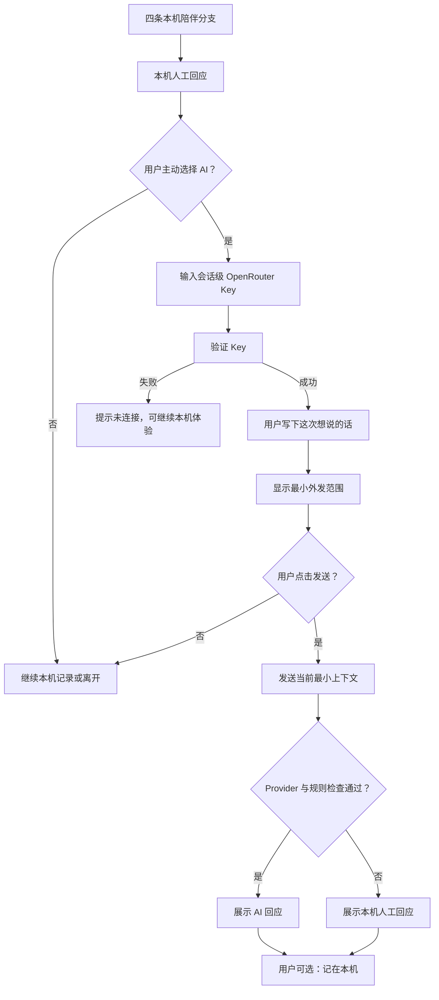

# 阶段 4：可选 AI 设计

## 1. 阶段目标

阶段 4 在完整的无 Key 本机体验之外，增加由用户主动开启的 AI 能力。

AI 是一条可选支路，不是首页入口、启动门槛或保存记录的前提。用户不连接 Key、Key 无效、免费模型繁忙或网络中断时，四条核心陪伴流程、文字记录、照片只记录和运动记录都必须照常可用。

## 2. 第一切片范围

本切片交付：

- OpenRouter 真实 Provider Adapter，默认使用 `openrouter/free`。
- 用户在当前页面中输入自己的 OpenRouter Key，并主动验证。
- Key 只保留在 React 组件内存中；不写入 IndexedDB、`localStorage`、`sessionStorage`、导出文件或构建环境变量。
- 用户从本机回应页主动选择“想让 AI 再听听”。
- 没有本机记录的新用户首次打开时看到三步轻引导；已有记录的用户不被自动打断。
- 首页长期保留“30 秒看看怎么用”的重开入口，回应页的 AI 行显示“可选 AI”标签。
- 发送前明确说明：只发送当前状态、当前选择、本机回应和用户刚写的文字。
- 照片、历史记录和身体资料不随第一切片请求发送。
- AI 回应经过非审判规则检查；Provider 出错或回应越界时退回本机人工回应。
- 用户可以把本次文字和最终回应保存到现有本机时间线，Key 不进入记录。

本切片不做：

- 图片理解或图片外发。
- 运动消耗估算。
- Key 的本机加密长期保存。
- 多轮对话、全量历史拼接或自动画像。
- 登录、账户、云同步或自有模型代理。

## 3. 用户链路

### 3.1 新手引导

新用户首次打开时，不直接展示 Key 输入或模型设置，而是用三步说明正常使用顺序：

1. 先从四种状态里挑一句。
2. 先得到不需要登录和 Key 的本机回应。
3. 想多说一点时，在回应页靠下的位置找到“想让 AI 再听听”。

引导可以跳过，跳过与完成都只写入一项设备本地的界面偏好，不进入 IndexedDB、记录导出或同步契约。首页保留重开入口，因此用户之后仍能随时再看。AI 入口仍位于本机回应之后，不新增为第五个核心状态入口。

### 3.2 AI 回应链路

输入 Key 不等于同意发送正文。只有用户再次点击“发送给 OpenRouter”，当前文字才离开设备。

## 4. 外发与存储边界

### 会发送

- 当前状态的短标签。
- 用户刚选择的陪伴意图。
- 当前页面已经展示的本机回应。
- 用户在 AI 页面刚写下的文字。

### 不会发送

- 本机用户 ID。
- 其他历史记录。
- 本机照片与缩略图。
- 运动详情。
- 身高、体重或目标资料。
- 任何账户或设备标识。

### 不会保存

- OpenRouter Key。
- Provider 原始错误正文。
- 隐藏的推理过程。

本切片的“会话级 Key”指当前页面组件存活期间的内存状态。刷新、离开该页面或点击“移除 Key”后需要重新连接。

## 5. Provider 与降级

统一接口保留 `validateKey()` 与 `respond()` 两个职责。OpenRouter Adapter 使用浏览器 `fetch` 直连：

- Key 通过 `Authorization: Bearer ...` 请求头发送。
- 默认模型为 `openrouter/free`，不把具体免费模型名称写死在业务流程。
- 返回结果记录实际路由到的模型名称，便于用户知道谁回应了这次请求。
- 401/403、余额不足、限流、模型不可用、网络错误和无文本响应统一转为可识别的 Provider 失败。
- 用户界面不责怪用户，也不展示供应商错误堆栈；失败时保留输入并给出本机回应。

`openrouter/free` 的可用模型、限流和响应速度会变化，因此它适合第一条真实 BYOK 验证链路，不被描述为永久稳定的免费服务。接口依据见 [OpenRouter Free Models Router](https://openrouter.ai/docs/guides/routing/routers/free-router)、[API Authentication](https://openrouter.ai/docs/api/reference/authentication) 与 [Errors and Debugging](https://openrouter.ai/docs/api/reference/errors-and-debugging)。

## 6. 非审判规则

模型请求先带入明确的陪伴规则，返回后再做本地检查。以下内容不直接展示：

- 把用户描述为失败、不自律或意志力差。
- 用罪恶、羞耻、惩罚或赎罪解释进食与休息。
- 要求用运动抵消进食，或用断食、少吃一顿、催吐补偿。
- 把必须消耗、减掉或忍住作为回应主线。

检查不通过时使用当前分支已经人工审核的本机回应。模型不能覆盖产品规则。

## 7. 第一切片验收项

- `S4-AI-01`：不连接 Key 时，原有本机体验与保存路径完整可用。
- `S4-AI-02`：Key 不进入本机数据库、浏览器持久存储、导出、源码或构建变量。
- `S4-AI-03`：验证 Key 与发送正文是两次独立的用户动作。
- `S4-AI-04`：发送前页面明确说明 Provider 和最小外发内容。
- `S4-AI-05`：第一切片不发送照片、历史记录、运动详情和身体资料。
- `S4-AI-06`：Key 错误、限流、断网或 Provider 不可用时保留用户输入并回退本机回应。
- `S4-AI-07`：模型返回补偿性运动、羞辱或惩罚性语言时不直接展示。
- `S4-AI-08`：使用真实 OpenRouter Key 可以完成至少一次 Key 验证与文字回应。
- `S4-AI-09`：AI 回应只有在用户主动选择后才写入本机时间线，Key 不随记录保存。
- `S4-AI-10`：无本机记录且未完成引导的新用户会看到三步引导；已有记录的用户不自动弹出。
- `S4-AI-11`：首页可以重新打开引导，回应页可以直接看见“可选 AI”标签，四个核心入口仍保持第一优先级。

## 8. 后续切片

阶段 4 后续按隐私风险从低到高推进：

1. 真机体验验收本切片的 Key 连接、发送确认、AI 回应和本机降级。
2. 增加“记住在本机”的 Web Crypto 加密 Key Vault，并明确浏览器本地保护边界。
3. 为已经本机处理的照片增加独立的图片外发确认，不改动“只记录”零网络路径。
4. 仅在用户主动询问时增加运动消耗宽松范围，并持续显示不确定性。
5. 根据真实需要决定是否增加第二个 Provider，而不是预先堆叠供应商。

## 9. 当前状态

截至 2026-07-11，第一切片已通过用户体验验收：真实 OpenRouter Adapter、会话级 Key、明确发送确认、文字回应、本机规则检查、失败降级、本机保存与三步新手引导均已接入。新用户会自动看到引导，已有用户可从首页主动重开，回应页的 AI 行已有显式标签。自动化构建与相关契约测试通过；复用既有 OpenRouter Key 的真实请求也已完成 Key 验证、免费模型路由和本机规则检查，测试 Key 未写入项目。图片理解、运动消耗估算与 Key 的本机加密长期保存仍属于后续切片。
