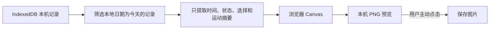

# 本机今日海报设计

## 1. 目标

把用户今天已经愿意保存在本机的状态与选择排成一张 3:4 图片。海报是生活记录的另一种摆放方式，不是日报、成绩单或打卡证明。

## 2. 第一切片范围

本切片交付：

- 首页辅助工具“生成今天的海报”。
- 只读取当前本地日期内已经保存的记录。
- 按发生时间展示最多五段状态与选择。
- 运动记录只展示活动类型、时长、步数或距离摘要。
- 在浏览器 Canvas 中生成 1080 × 1440 PNG。
- 用户主动点击后保存图片。

本切片不做：

- 不调用 AI 或外部图片服务。
- 不上传生成结果。
- 不放入照片、缩略图、用户原话、记录回应、AI 回应、身体资料或本机用户 ID。
- 不自动发布、分享或写入系统相册。
- 不展示完成度、连续天数、热量赤字或好坏评价。

## 3. 内容规则

海报顶部使用当天日期和一段随状态变化的短标题：

- 当天出现多种状态：`今天，有几种心情。都留在这里了。`
- 主要是想吃：`想吃这件事，今天被听见了。`
- 主要是休息：`今天，给自己留了点空。`
- 主要是练完很累：`今天动过，也真的累过。`
- 主要是回来看看：`今天，回来坐了一会儿。`

标题下固定说明：`不算完成度，只把今天放在这里。`

每段只显示时间、状态短标签和用户当时选择的去向。超过五段时，海报只说明还有若干段留在本机，不把次数包装成成就。

## 4. 数据与隐私边界

整个链路不需要网络。照片 Blob、用户文字与回应字段不进入海报模型，因此不是在渲染时隐藏，而是在数据提取阶段就不读取。

## 5. 空状态

如果今天没有已经保存的记录，页面不生成空白海报，也不催促打卡。只说明：

> 今天还没有可以做成海报的选择。先从首页挑一句，愿意的话把那次选择记下来，再回来看看。

## 6. 验收项

- `POSTER-01`：入口位于四个核心状态之后的首页辅助工具区。
- `POSTER-02`：只使用本地日期为今天且已经保存的记录。
- `POSTER-03`：海报模型不读取照片、原话、回应、身体资料或用户 ID。
- `POSTER-04`：运动记录只使用既有非评分摘要。
- `POSTER-05`：生成 1080 × 1440 PNG，预览与下载使用同一份本机 Blob。
- `POSTER-06`：生成过程没有网络调用、AI Provider 或云端存储。
- `POSTER-07`：没有今天的记录时显示温和空状态，不制造打卡压力。
- `POSTER-08`：海报文案不出现完成度、连续天数、失败、超标或补偿建议。

## 7. 当前状态

截至 2026-07-11，第一切片已完成候选实现，等待用户手机端体验验收。
